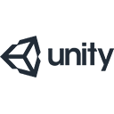
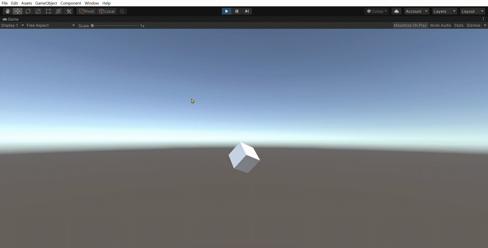

## Unity 기초

### 환경 설정(`Unity`+`VSCode`)

- 그래픽 환경

1. Unity Hub 다운로드 & 설치
2. Unity 설치: `LTS`(Long Term Support) 버전(현재는 `2019.4.20f1`)
3. Unity Project 생성: Template-`3D`

- 스크립트 환경

1. Visual Studio Code 설치
2. VSCode Extension 설치
   - |                     C#                      |                           Debugger for Unity                            |                        Unity Tools                        |                            Unity Code Snippets                            |
     | :-----------------------------------------: | :---------------------------------------------------------------------: | :-------------------------------------------------------: | :-----------------------------------------------------------------------: |
     |  |  |  |  |
3. Unity Code Editor 설정
   - | `Preferences`-`External Tools`-`External Script Editor`-`Visual Studio Code` |
     | :--------------------------------------------------------------------------: |
     |  |

### 화면 창(Window)

|   view    |               description                |
| :-------: | :--------------------------------------: |
|   Scene   | (=영화 세트장), GameObject가 배치된 View |
| Hierarchy |       GameObject의 List(Tree 형태)       |
|  Project  |     Project와 관련된 모든 파일 표시      |
|   Game    |   Main Camera에 의해 렌더링 되는 View    |
| Inspector |  선택한 GameObject에 대한 컴포넌트 정보  |
|    ...    |                   ...                    |

### 유용한 단축키

|                       단축키                       |                 description                 |
| :------------------------------------------------: | :-----------------------------------------: |
|                     `Ctrl`+`P`                     |                 Play / Stop                 |
|                 `Ctrl`+`Shift`+`N`                 |               New GameObject                |
|           `RMB Click`+`W`, `A`, `S`, `D`           |              Scene View 움직임              |
|             `RMB Click`+`Mouse Wheel`              |         Scene View 움직임 속도 조절         |
|                     `Ctrl`+`Z`                     |                  되돌리기                   |
|                    `W` in Scene                    |          Move tool(Object Control)          |
|                    `E` in Scene                    |                 Rotate tool                 |
|                    `R` in Scene                    |                 Scale tool                  |
| `Camera GameObject Click` + `Ctrl` + `Shift` + `F` | Scene View와 Camera View의 Transfrom 동기화 |
|               `Ctrl` + `Shift` + `C`               |            Console 창 뜨게 하기             |
|                        ...                         |                     ...                     |

### Component Pattern

- Code를 부품화해서 관리한다.
- Unity에서 모든 GameObject는 컴포넌트 정보에 따라 달라진다.
- C# Script를 작성하여 컴포넌트로 사용한다.

- Unity 에서는 MonoBehaviour를 상속을 해야 컴포넌트로써 실행이 가능

  - 따라서, MonoBehaviour를 상속받는 Class는 `new 클래스명();` 불가능
  - Create C# Script--상속--`MonoBehaviour Class`----`Behaviour`----`Component`----`Object`

- ex) 오브젝트 회전 컴포넌트

  ```cs
  using System.Collections;
  using System.Collections.Generic;
  using UnityEngine;

  public class Test : MonoBehaviour
  {
      void Update()
      {
          transform.Rotate(new Vector3(1.0f, 1.0f, 1.0f));
      }
  }
  ```

  |                              결과                              |
  | :------------------------------------------------------------: |
  |  |

### Singleton Pattern

- 대부분 관리(`Managing`)하는 객체(`Instance`)는 오직 1개만 존재해야 함.
  - 최초의 생성자로 1번만 객체를 생성.
  - 여러 차례 생성자를 호출하면 최초로 생성된 객체를 `return` 해준다.

#### GameManager 예제

- `GameManager는` 어디서든 접근할 수 있고 객체는 오직 1개만 존재.

  1. `MonoBehaviour` Class를 상속 O

     - `GameObject`로 관리
       > `GameObject.Find("@GameManager");` 이용

     ```cs
     using System.Collections;
     using System.Collections.Generic;
     using UnityEngine;

     public class GameManager : MonoBehaviour // MonoBehaviour를 상속
     {
         private static GameManager instance;    // 유일성 보장
         public static GameManager Instance
         {
             get
             {
                 if (instance == null) init();
                 return instance;
             }
         }    // get, Property 이용

         static void init()
         {
             // 이름으로 GameManager를 찾음.
             GameObject go = GameObject.Find("@GameManager");
             if (go == null)
             {
                 // "@GameManager"의 GameObject가 없다면 Object 생성
                 go = new GameObject { name = "@GameManager" };
                 go.AddComponent<GameManager>();   // Script 컴포넌트 추가
             }
             // 삭제하지 못하게 함, Scene이 이동해도 제거되지 않음.
             DontDestroyOnLoad(go);
             instance = go.GetComponent<GameManager>();
         }
     }
     ```

  2. `MonoBehaviour` Class를 상속 X

     - `Scene` 이동에 신경쓸 필요 없는 장점이 있다.
     - 눈에 보이지 않는 단점으로 보통은 1번 방법 사용

     ```cs
     public class GameManager    // MonoBehaviour를 상속받지 않음.
     {
         private static GameManager instance;    // 유일성 보장
         public static GameManager Instance
         {
             // get, property 이용
             get
             {
                 if (instance == null) instance = new GameManager();
                 return instance;
             }
         }
         public GameManager()
         {
             // 초기화 코드
         }
     }
     ```
